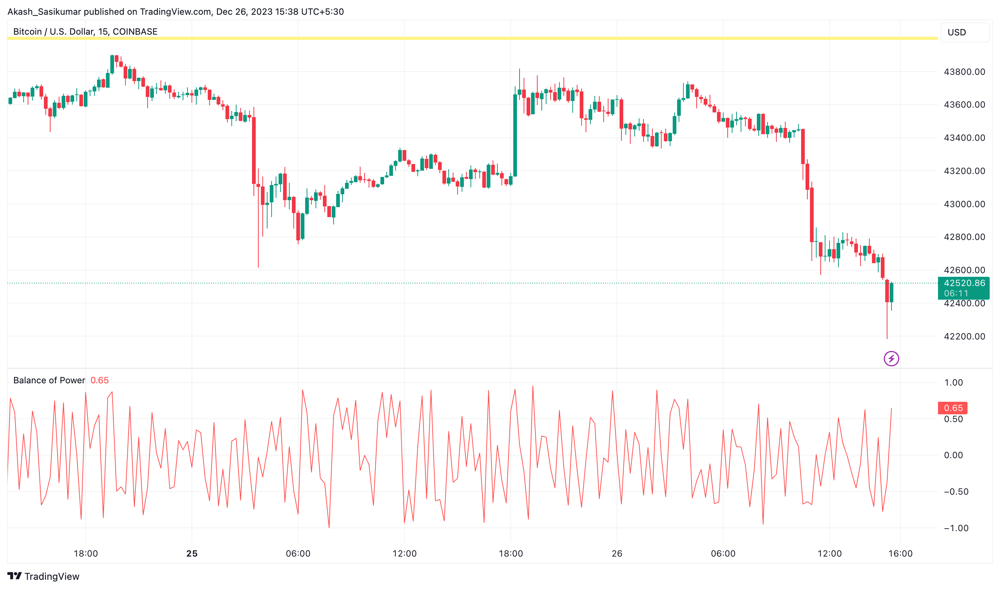
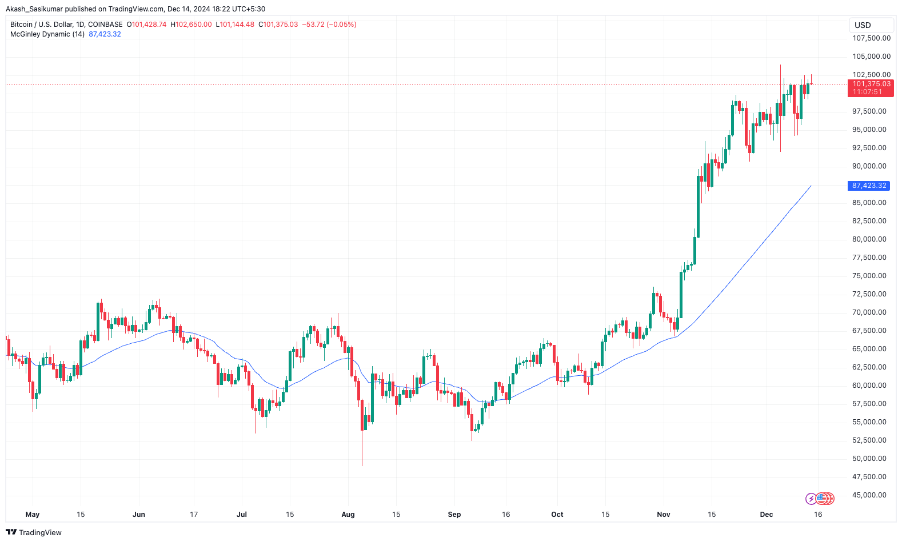
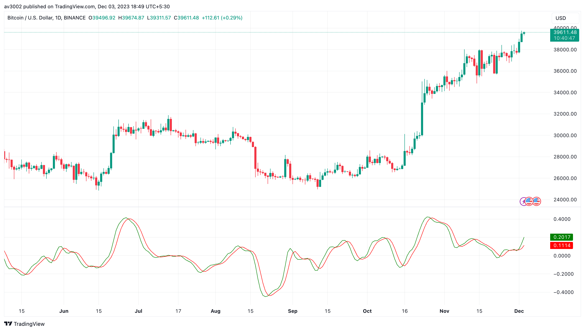
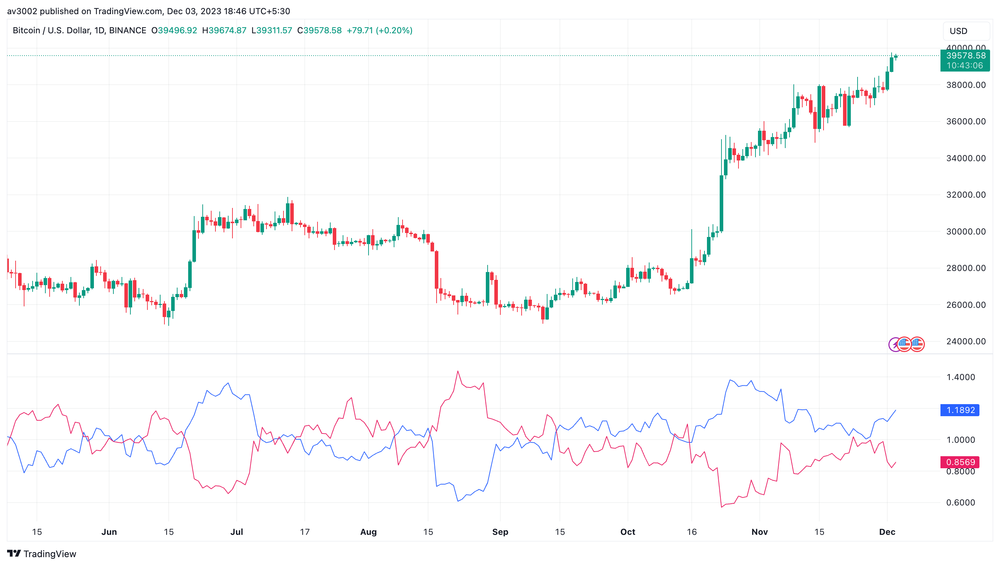
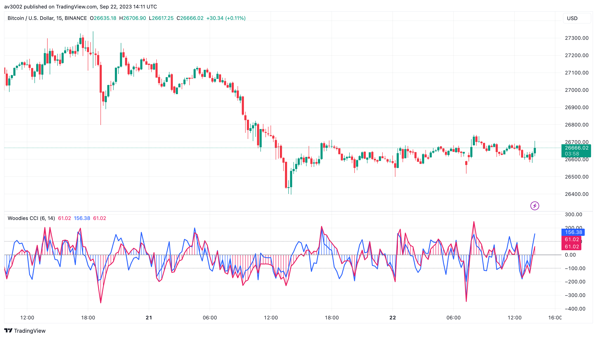

  <h1>📈 Custom Strategy Indicators V3</h1>
  
Technical indicators are essential in 📈 stock market analysis and trading. They provide insights into price trends, momentum, and market sentiment, guiding informed decision-making. Proficiency in these indicators is vital for success in the dynamic and competitive financial markets.

## 📈 Indicators Included

The following indicators are included in this repository:

- 💡 Balance of Power
- 🌐 McGinley Dynamic
- ⚛️ Relative Vigor Index
- 🌿 Vortex Indicator
- ⚙️ Woodies CCI

## 📋 Indicator Descriptions

### Balance of Power 💡

The Balance of Power (BOP) indicator measures the strength of buyers versus sellers. It calculates the balance between demand and supply by comparing price movements within a specific period.

#### Use Case 📈
- Utilize BOP to gauge market strength and potential reversals.
- Combine it with trend indicators to enhance accuracy.

#### How to Use 📋
1. **Installation**: Add the Balance of Power indicator to your preferred trading platform (e.g., TradingView).
2. **Configuration**: Adjust the look-back period to align with your strategy.
3. **Interpretation**: Positive BOP values indicate buying pressure, while negative values suggest selling pressure.

### McGinley Dynamic 🌐

The McGinley Dynamic is a smoothing indicator that adjusts to market conditions. Unlike traditional moving averages, it reduces lag in volatile markets and stays close to the price during less volatile periods.

#### Use Case 📈
- Use McGinley Dynamic to identify trend direction with minimal lag.
- Combine it with oscillators for confirmation.

#### How to Use 📋
1. **Installation**: Add the McGinley Dynamic indicator to your trading platform.
2. **Configuration**: Adjust the smoothing factor to suit your trading style.
3. **Interpretation**: Observe price crossover with the McGinley Dynamic to identify trend changes.

### Relative Vigor Index ⚛️

The Relative Vigor Index (RVI) measures the conviction of a trend by comparing closing and opening prices over a given period. It generates a line that oscillates around a central line.

#### Use Case 📈
- Use RVI to confirm trend direction.
- Pair it with momentum indicators for better precision.

#### How to Use 📋
1. **Installation**: Add the RVI indicator to your trading platform.
2. **Configuration**: Adjust the period length to match your analysis timeframe.
3. **Interpretation**: Crossovers between the RVI and its signal line may indicate potential buy or sell opportunities.

### Vortex Indicator 🌿

The Vortex Indicator identifies trend direction and strength by analyzing highs, lows, and closing prices. It consists of two lines (VI+ and VI-) that indicate bullish and bearish trends, respectively.

#### Use Case 📈
- Use the Vortex Indicator to detect trend reversals.
- Combine it with support/resistance levels for entry and exit points.

#### How to Use 📋
1. **Installation**: Add the Vortex Indicator to your trading platform.
2. **Configuration**: Set the indicator's period length to align with your strategy.
3. **Interpretation**: A crossover of VI+ above VI- suggests a bullish trend, and vice versa.

### Woodies CCI ⚙️

Woodies CCI (Commodity Channel Index) is a variation of the traditional CCI, used for identifying trends and overbought/oversold conditions. It incorporates pattern recognition for additional trading insights.

#### Use Case 📈
- Apply Woodies CCI to identify trend reversals and entry/exit points.
- Combine it with moving averages for added confirmation.

#### How to Use 📋
1. **Installation**: Add the Woodies CCI indicator to your trading platform.
2. **Configuration**: Use default settings or customize the look-back period as per your strategy.
3. **Interpretation**: Values above 100 indicate an uptrend, while values below -100 suggest a downtrend.

## 🚀 Usage and Instructions

To use these indicators:
1. Open the TradingView Pine Script editor.
2. Copy the Pine Script code of the desired indicator from this repository.
3. Paste the code in the Pine Script editor.
4. Customize the indicator's parameters as needed.
5. Apply the indicator to your chart to visualize its signals.

Feel free to explore, modify, and integrate these indicators into your trading strategies. Happy trading!